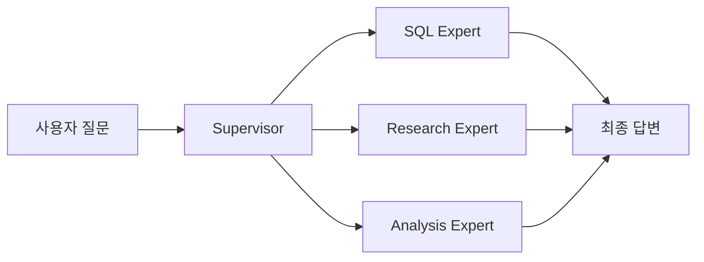

# LangGraph Supervisor Multi-Agent 시스템

## 목표

`langgraph-supervisor` 라이브러리를 사용하여 Supervisor가 여러 전문 에이전트를 조율하는 시스템 구축

## 아키텍처



## 구현 컴포넌트

### 1. Worker Agents
- **SQL Expert**: 자연어 → SQL 변환 및 실행
- **Research Expert**: 정보 수집 및 분석
- **Analysis Expert**: 데이터 분석 및 인사이트

### 2. Supervisor
- `create_supervisor()`로 생성
- Tool-based handoff로 에이전트 간 통신
- 자동 라우팅 및 조율

### 3. 더미 데이터
- 10명의 테스트 사용자 (2024년 10-11월)
- SQL 쿼리 실행 시뮬레이션
- 실제 결과 반환

## API 엔드포인트

### POST `/agentic-query`

**요청:**
```json
{
  "question": "저번달 가입자 알려줘"
}
```

**응답:**
```json
{
  "question": "저번달 가입자 알려줘",
  "final_answer": "최종 답변...",
  "agent_responses": [
    {"agent": "supervisor", "response": "..."},
    {"agent": "sql_expert", "response": "SQL 쿼리 및 실행 결과..."}
  ],
  "message_count": 7
}
```

## 검증 계획

1. 서버 실행
2. 다양한 질문 테스트
3. 에이전트별 응답 확인
4. SQL 실행 결과 검증
