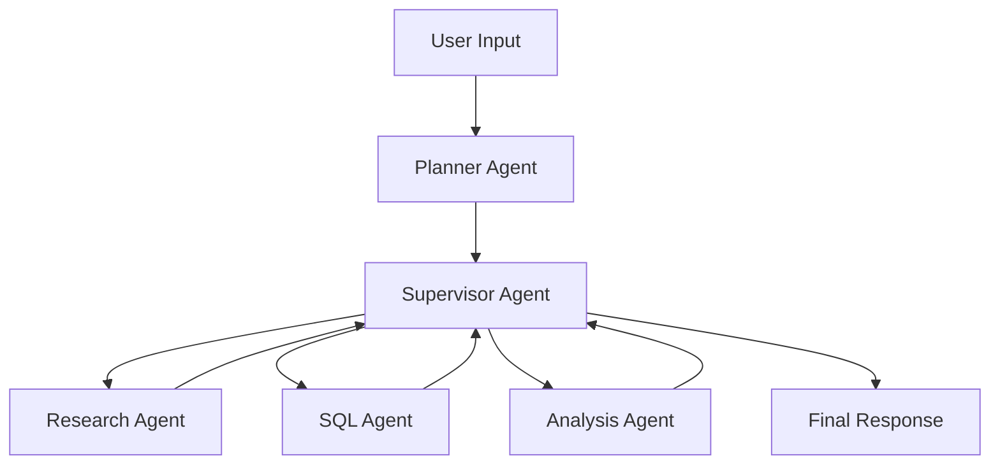

# LangGraph Planner-Supervisor Agentic AI 구현 계획

## 개요

현재 프로젝트에는 간단한 text-to-sql 변환 기능이 있습니다. 이를 LangGraph의 **Planner 기반 Supervisor 아키텍처**로 확장하여, 복잡한 작업을 계획하고 여러 전문화된 에이전트를 조율하는 시스템을 구축합니다.

### 아키텍처 개념



**핵심 구성 요소:**
- **Planner**: 사용자 요청을 분석하고 다단계 실행 계획 생성
- **Supervisor**: 계획을 바탕으로 적절한 worker 에이전트에게 작업 위임 및 조율
- **Worker Agents**: 특정 작업을 수행하는 전문화된 에이전트들
  - Research Agent: 정보 검색 및 조사
  - SQL Agent: 데이터베이스 쿼리 생성 및 실행
  - Analysis Agent: 데이터 분석 및 인사이트 도출

## Proposed Changes

### Core Components

#### [NEW] [state.py](file:///Users/playauto/Documents/GitHub/python-fastapi/app/langgraph/state.py)

전체 시스템의 상태를 관리하는 TypedDict 정의:
- `messages`: 대화 히스토리
- `plan`: Planner가 생성한 실행 계획
- `current_step`: 현재 실행 중인 단계
- `agent_outputs`: 각 에이전트의 출력 결과
- `final_answer`: 최종 응답

#### [NEW] [agents/planner.py](file:///Users/playauto/Documents/GitHub/python-fastapi/app/langgraph/agents/planner.py)

사용자 요청을 분석하고 실행 계획을 생성하는 Planner 에이전트:
- 요청 분석 및 필요한 단계 식별
- 구조화된 계획 생성 (JSON 형식)
- 각 단계에 적절한 에이전트 할당

#### [NEW] [agents/supervisor.py](file:///Users/playauto/Documents/GitHub/python-fastapi/app/langgraph/agents/supervisor.py)

계획을 실행하고 worker 에이전트를 조율하는 Supervisor:
- 계획의 각 단계를 순차적으로 실행
- 적절한 worker 에이전트 선택 및 호출
- 에이전트 간 정보 전달 및 상태 업데이트
- 에러 처리 및 재시도 로직

#### [NEW] [agents/workers/research_agent.py](file:///Users/playauto/Documents/GitHub/python-fastapi/app/langgraph/agents/workers/research_agent.py)

정보 검색 및 조사를 수행하는 에이전트:
- 주어진 주제에 대한 정보 수집
- 컨텍스트 분석 및 요약

#### [NEW] [agents/workers/sql_agent.py](file:///Users/playauto/Documents/GitHub/python-fastapi/app/langgraph/agents/workers/sql_agent.py)

기존 SQL 생성 로직을 에이전트로 리팩토링:
- 자연어를 SQL로 변환
- SQL 검증 및 최적화
- 쿼리 실행 (선택적)

#### [NEW] [agents/workers/analysis_agent.py](file:///Users/playauto/Documents/GitHub/python-fastapi/app/langgraph/agents/workers/analysis_agent.py)

데이터 분석 및 인사이트 도출 에이전트:
- 데이터 패턴 분석
- 통계적 요약 생성
- 인사이트 및 권장사항 제공

---

#### [MODIFY] [graph.py](file:///Users/playauto/Documents/GitHub/python-fastapi/app/langgraph/graph.py)

기존 단순 그래프를 planner-supervisor 아키텍처로 재구성:
- 새로운 State 스키마 적용
- Planner, Supervisor, Worker 노드 추가
- 조건부 엣지를 사용한 동적 라우팅
- 계획 실행 완료 조건 정의

#### [MODIFY] [main.py](file:///Users/playauto/Documents/GitHub/python-fastapi/app/main.py)

새로운 엔드포인트 추가 및 기존 엔드포인트 업데이트:
- `/agentic-query`: Planner-Supervisor 시스템을 사용하는 새 엔드포인트
- `/text-to-sql`: 기존 엔드포인트 유지 (하위 호환성)
- 스트리밍 응답 지원 (선택적)

---

### Supporting Files

#### [NEW] [agents/__init__.py](file:///Users/playauto/Documents/GitHub/python-fastapi/app/langgraph/agents/__init__.py)

에이전트 모듈 초기화 파일

#### [NEW] [agents/workers/__init__.py](file:///Users/playauto/Documents/GitHub/python-fastapi/app/langgraph/agents/workers/__init__.py)

Worker 에이전트 모듈 초기화 파일

#### [NEW] [tools.py](file:///Users/playauto/Documents/GitHub/python-fastapi/app/langgraph/tools.py)

에이전트가 사용할 수 있는 도구 정의:
- 웹 검색 도구 (선택적)
- 데이터베이스 쿼리 실행 도구
- 계산 도구

## Verification Plan

### Automated Tests

#### 1. 단위 테스트
새로운 테스트 파일 생성: `tests/test_agentic_system.py`

```bash
# 테스트 실행 명령어
pytest tests/test_agentic_system.py -v
```

테스트 항목:
- Planner가 올바른 계획을 생성하는지 검증
- Supervisor가 올바른 에이전트를 선택하는지 검증
- 각 Worker 에이전트의 기본 기능 검증
- State 업데이트가 올바르게 동작하는지 검증

#### 2. 통합 테스트
전체 그래프 실행 테스트:

```bash
# 개발 서버 실행
uvicorn app.main:app --reload --port 8000

# 별도 터미널에서 테스트 요청
curl -X POST http://localhost:8000/agentic-query \
  -H "Content-Type: application/json" \
  -d '{"question": "사용자 테이블에서 최근 7일간 가입한 사용자 수를 분석해줘"}'
```

### Manual Verification

사용자가 직접 다양한 복잡도의 질문을 테스트:

1. **간단한 SQL 쿼리 요청**
   - 예: "모든 사용자의 이메일을 조회해줘"
   - 예상: SQL Agent만 사용하여 빠르게 응답

2. **분석이 필요한 복잡한 요청**
   - 예: "지난 달 가입자 추이를 분석하고 인사이트를 제공해줘"
   - 예상: SQL Agent + Analysis Agent 조합 사용

3. **다단계 작업이 필요한 요청**
   - 예: "사용자 데이터를 조회하고, 패턴을 분석한 후, 개선 방안을 제안해줘"
   - 예상: 여러 에이전트가 순차적으로 협력

각 테스트 후 응답에서 다음을 확인:
- `plan`: 생성된 실행 계획이 합리적인지
- `agent_outputs`: 각 에이전트의 출력이 올바른지
- `final_answer`: 최종 답변이 질문에 적절한지

## 구현 순서

1. State 스키마 정의
2. Worker 에이전트 구현 (기존 SQL 로직 활용)
3. Planner 에이전트 구현
4. Supervisor 에이전트 구현
5. 그래프 재구성
6. FastAPI 엔드포인트 추가
7. 테스트 작성 및 검증
