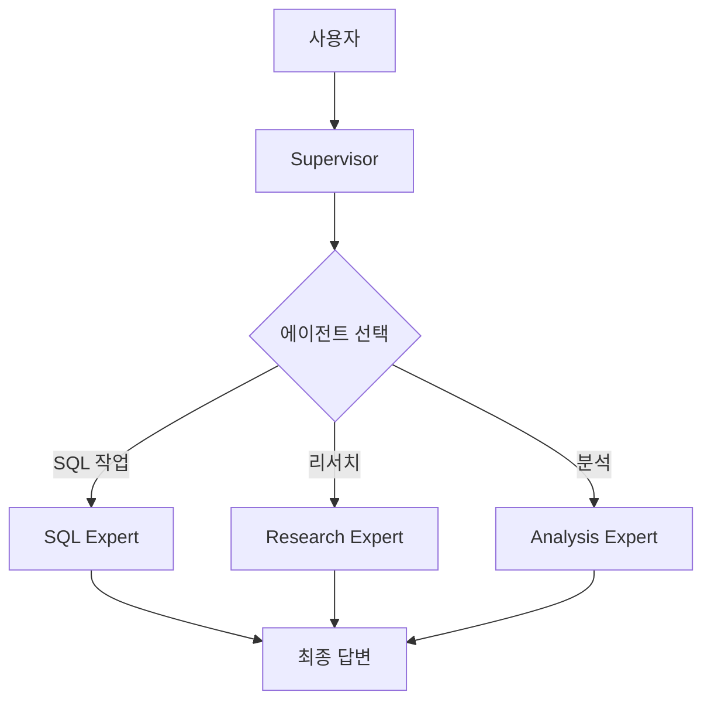

# LangGraph Supervisor Multi-Agent 시스템

## 시스템 구조



**핵심 기능:**
- ✅ Supervisor가 자동으로 적절한 에이전트 선택
- ✅ Tool-based handoff로 에이전트 간 통신
- ✅ 더미 데이터로 실제 SQL 실행
- ✅ 한국어 응답

## 구현 파일

### 1. Worker Agents ([workers.py](file:///Users/playauto/Documents/GitHub/python-fastapi/app/langgraph/agents/workers.py))

3개의 전문 에이전트:

```python
# SQL Expert - SQL 생성 및 실행
sql_agent = create_react_agent(
    model=model,
    tools=[generate_sql_query],
    name="sql_expert"
)

# Research Expert - 정보 수집
research_agent = create_react_agent(
    model=model,
    tools=[research_topic],
    name="research_expert"
)

# Analysis Expert - 데이터 분석
analysis_agent = create_react_agent(
    model=model,
    tools=[analyze_data],
    name="analysis_expert"
)
```

### 2. Supervisor ([supervisor_graph.py](file:///Users/playauto/Documents/GitHub/python-fastapi/app/langgraph/supervisor_graph.py))

```python
from langgraph_supervisor import create_supervisor

workflow = create_supervisor(
    agents=[sql_agent, research_agent, analysis_agent],
    model=model,
    prompt="팀 슈퍼바이저...",
    output_mode="last_message"
)
```

### 3. 더미 데이터 ([dummy_data.py](file:///Users/playauto/Documents/GitHub/python-fastapi/app/langgraph/dummy_data.py))

10명의 테스트 사용자:
- 2024년 10월: 4명
- 2024년 11월: 6명

## 테스트 결과

### 테스트 1: 저번달 가입자 조회

**요청:**
```bash
curl -X POST http://localhost:8000/agentic-query \
  -H "Content-Type: application/json" \
  -d '{"question": "저번달 가입자 알려줘"}'
```

**응답:**
```json
{
  "question": "저번달 가입자 알려줘",
  "final_answer": "지난달(10월) 가입자는 총 4명입니다...",
  "agent_responses": [
    {
      "agent": "supervisor",
      "response": "SQL 전문가에게 요청하겠습니다."
    },
    {
      "agent": "sql_expert",
      "response": "SQL 쿼리:\n```sql\nSELECT * FROM user WHERE...\n```\n\n실행 결과:\n총 4명의 사용자:\n- user1@example.com\n- user2@example.com\n..."
    }
  ],
  "message_count": 7
}
```

### 응답 구조 설명

- **`question`**: 사용자 질문
- **`final_answer`**: 최종 답변 (마지막 의미있는 응답)
- **`agent_responses`**: 에이전트별 응답 배열
  - `agent`: 에이전트 이름 (supervisor, sql_expert 등)
  - `response`: 해당 에이전트의 응답
- **`message_count`**: 전체 메시지 수

## 파일 구조

```
app/
├── langgraph/
│   ├── supervisor_graph.py    # Supervisor 생성
│   ├── dummy_data.py           # 테스트 데이터
│   └── agents/
│       └── workers.py          # Worker 에이전트
├── services/
│   └── bedrock.py              # AWS Bedrock LLM
└── main.py                     # FastAPI
```

## 다음 단계

1. **실제 DB 연결**: PostgreSQL/MySQL 연동
2. **더 많은 에이전트**: 웹 검색, 계산 등
3. **스트리밍**: 실시간 응답
4. **메모리**: 대화 기록 저장
