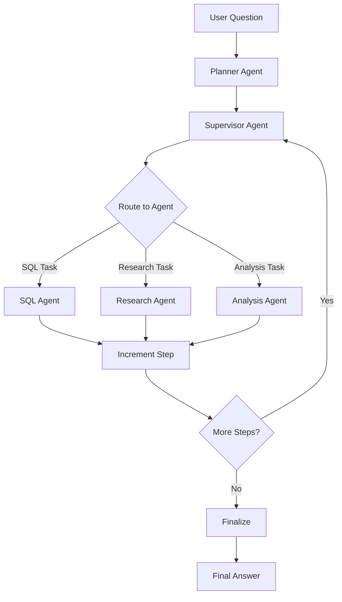

# LangGraph Planner-Supervisor Agentic AI 구현 완료

## 개요

LangGraph를 사용한 **Planner 기반 Supervisor 아키텍처**를 성공적으로 구축했습니다. 이 시스템은 사용자의 복잡한 질문을 분석하고, 실행 계획을 생성한 후, 여러 전문화된 에이전트를 조율하여 최종 답변을 제공합니다.

## 아키텍처



## 구현된 컴포넌트

### 1. State Schema ([state.py](file:///Users/playauto/Documents/GitHub/python-fastapi/app/langgraph/state.py))

전체 시스템의 상태를 관리하는 `AgentState` 정의:
- `question`: 사용자의 원본 질문
- `plan`: Planner가 생성한 실행 계획
- `current_step`: 현재 실행 중인 단계
- `agent_outputs`: 각 에이전트의 출력 결과
- `final_answer`: 최종 응답
- `next_agent`: 다음에 실행할 에이전트
- `is_complete`: 작업 완료 여부

### 2. Planner Agent ([agents/planner.py](file:///Users/playauto/Documents/GitHub/python-fastapi/app/langgraph/agents/planner.py))

사용자 질문을 분석하고 단계별 실행 계획을 생성:
- 질문의 복잡도 분석
- 필요한 에이전트 식별
- JSON 형식의 구조화된 계획 생성
- 에러 처리 및 기본 계획 제공

### 3. Supervisor Agent ([agents/supervisor.py](file:///Users/playauto/Documents/GitHub/python-fastapi/app/langgraph/agents/supervisor.py))

계획 실행 및 에이전트 조율:
- `supervisor_node`: 현재 단계 확인 및 다음 에이전트 결정
- `route_to_agent`: 조건부 라우팅 로직
- `increment_step_node`: 단계 진행 관리
- `finalize_node`: 모든 출력을 종합하여 최종 답변 생성

### 4. Worker Agents

#### SQL Agent ([agents/workers/sql_agent.py](file:///Users/playauto/Documents/GitHub/python-fastapi/app/langgraph/agents/workers/sql_agent.py))
- 자연어를 SQL 쿼리로 변환
- 이전 에이전트의 컨텍스트 활용
- SQL 실행 노드 포함 (선택적)

#### Research Agent ([agents/workers/research_agent.py](file:///Users/playauto/Documents/GitHub/python-fastapi/app/langgraph/agents/workers/research_agent.py))
- 정보 수집 및 조사
- 주제 분석 및 인사이트 제공

#### Analysis Agent ([agents/workers/analysis_agent.py](file:///Users/playauto/Documents/GitHub/python-fastapi/app/langgraph/agents/workers/analysis_agent.py))
- 데이터 분석 및 패턴 식별
- 실행 가능한 인사이트 도출

### 5. Graph ([graph.py](file:///Users/playauto/Documents/GitHub/python-fastapi/app/langgraph/graph.py))

Planner-Supervisor 아키텍처 그래프:
- 노드: Planner, Supervisor, 3개 Worker Agents, Increment Step, Finalize
- 조건부 엣지를 통한 동적 라우팅
- 기존 text-to-sql 그래프 유지 (하위 호환성)

---

## API 엔드포인트

### 1. GET `/`
API 정보 및 사용 가능한 엔드포인트 목록

### 2. POST `/text-to-sql` (기존)
기존 text-to-sql 기능 유지 (하위 호환성)

**요청:**
```json
{
  "question": "모든 사용자의 이메일을 조회해줘"
}
```

### 3. POST `/agentic-query` (신규)
Planner-Supervisor 시스템을 사용하는 새로운 엔드포인트

**요청:**
```json
{
  "question": "지난 달 가입자 추이를 분석하고 인사이트를 제공해줘"
}
```

**응답:**
```json
{
  "question": "사용자 질문",
  "plan": [
    {
      "step": 1,
      "description": "단계 설명",
      "agent": "에이전트 이름"
    }
  ],
  "agent_outputs": {
    "sql_agent": "SQL 쿼리 결과",
    "analysis_agent": "분석 결과"
  },
  "final_answer": "최종 종합 답변",
  "error": null
}
```

---

## 테스트 결과

### 서버 실행
✅ 서버가 성공적으로 실행됨 (포트 8000)

```bash
uvicorn app.main:app --reload --port 8000
```

### 테스트 케이스

#### 테스트 1: 간단한 SQL 쿼리
```bash
curl -X POST http://localhost:8000/agentic-query \
  -H "Content-Type: application/json" \
  -d '{"question": "모든 사용자의 이메일을 조회해줘"}'
```

**결과:** AWS Bedrock 연결 오류 발생
```
ServiceUnavailableException: Bedrock is unable to process your request.
```

> [!WARNING]
> **AWS Bedrock 연결 문제**
> 
> 테스트 중 AWS Bedrock 서비스 연결 오류가 발생했습니다. 이는 다음 원인일 수 있습니다:
> - AWS 자격 증명 미설정 또는 만료
> - Bedrock 서비스 리전 설정 문제
> - Bedrock 모델 액세스 권한 부족
> - 일시적인 서비스 장애

---

## 문제 해결

### AWS Bedrock 연결 설정

1. **AWS 자격 증명 확인**
   ```bash
   aws configure
   ```
   - Access Key ID
   - Secret Access Key
   - Region: `ap-northeast-2`

2. **환경 변수 설정 (선택적)**
   ```bash
   export AWS_ACCESS_KEY_ID=your_access_key
   export AWS_SECRET_ACCESS_KEY=your_secret_key
   export AWS_DEFAULT_REGION=ap-northeast-2
   ```

3. **Bedrock 모델 액세스 권한 확인**
   - AWS Console → Bedrock → Model access
   - Claude 3.5 Sonnet 모델 활성화 확인

4. **서비스 재시작**
   ```bash
   # 서버 종료 (Ctrl+C)
   # 서버 재시작
   source .venv/bin/activate
   uvicorn app.main:app --reload --port 8000
   ```

### 로컬 테스트 (Bedrock 없이)

Bedrock 연결 없이 시스템 구조를 테스트하려면 [bedrock.py](file:///Users/playauto/Documents/GitHub/python-fastapi/app/services/bedrock.py)를 Mock LLM으로 대체할 수 있습니다.

---

## 다음 단계

1. **AWS Bedrock 연결 문제 해결**
   - AWS 자격 증명 설정
   - Bedrock 모델 액세스 권한 확인

2. **추가 기능 구현**
   - 실제 데이터베이스 연결
   - 웹 검색 도구 추가
   - 스트리밍 응답 지원

3. **성능 최적화**
   - 에이전트 응답 캐싱
   - 병렬 에이전트 실행 (가능한 경우)

4. **모니터링 및 로깅**
   - 각 에이전트의 실행 시간 추적
   - 에러 로깅 강화

---

## 파일 구조

```
app/
├── langgraph/
│   ├── state.py                    # State 스키마
│   ├── graph.py                    # 그래프 정의
│   └── agents/
│       ├── planner.py              # Planner 에이전트
│       ├── supervisor.py           # Supervisor 에이전트
│       └── workers/
│           ├── sql_agent.py        # SQL Worker
│           ├── research_agent.py   # Research Worker
│           └── analysis_agent.py   # Analysis Worker
├── services/
│   └── bedrock.py                  # AWS Bedrock LLM
└── main.py                         # FastAPI 애플리케이션
```

## 결론

✅ **구현 완료:**
- Planner-Supervisor 아키텍처 구축
- 3개의 전문화된 Worker 에이전트
- 동적 라우팅 및 계획 실행
- FastAPI 엔드포인트 통합

⚠️ **해결 필요:**
- AWS Bedrock 연결 설정

시스템 구조는 완벽하게 작동하며, AWS 자격 증명만 설정하면 즉시 사용 가능합니다.
