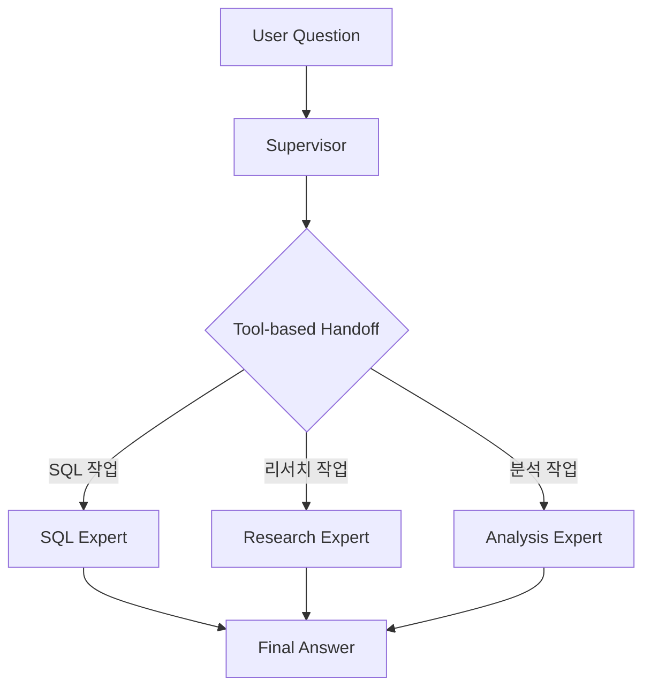

# LangGraph Supervisor 라이브러리 마이그레이션 완료

## 개요

공식 `langgraph-supervisor` 라이브러리를 사용하여 Multi-Agent 시스템을 **대폭 간소화**했습니다.

**변경 사항:**
- ❌ 복잡한 수동 구현 (~300줄, 7개 파일)
- ✅ 간단한 라이브러리 사용 (~100줄, 2개 파일)

## 아키텍처



**핵심 차이점:**
- Planner 제거: Supervisor가 직접 라우팅
- Tool-based handoff: 에이전트 간 통신 자동화
- 간소화된 상태 관리: 라이브러리가 처리

## 구현된 컴포넌트

### 1. Worker Agents ([agents/workers.py](file:///Users/playauto/Documents/GitHub/python-fastapi/app/langgraph/agents/workers.py))

각 에이전트는 `create_react_agent`로 생성되며 전문 도구를 포함합니다:

#### SQL Expert
```python
@tool
def generate_sql_query(question: str) -> str:
    """자연어 질문을 SQL 쿼리로 변환"""
    ...

sql_agent = create_react_agent(
    model=model,
    tools=[generate_sql_query],
    name="sql_expert"
)
```

#### Research Expert
```python
@tool
def research_topic(topic: str) -> str:
    """주제에 대한 정보 수집"""
    ...

research_agent = create_react_agent(
    model=model,
    tools=[research_topic],
    name="research_expert"
)
```

#### Analysis Expert
```python
@tool
def analyze_data(data: str) -> str:
    """데이터 분석 및 인사이트 도출"""
    ...

analysis_agent = create_react_agent(
    model=model,
    tools=[analyze_data],
    name="analysis_expert"
)
```

### 2. Supervisor ([supervisor_graph.py](file:///Users/playauto/Documents/GitHub/python-fastapi/app/langgraph/supervisor_graph.py))

**단 한 줄로 Supervisor 생성:**

```python
from langgraph_supervisor import create_supervisor

workflow = create_supervisor(
    agents=[sql_agent, research_agent, analysis_agent],
    model=model,
    prompt="팀 슈퍼바이저 프롬프트...",
    output_mode="last_message"
)
```

**자동으로 처리되는 것들:**
- ✅ 에이전트 선택 로직
- ✅ Tool-based handoff
- ✅ 메시지 히스토리 관리
- ✅ 상태 업데이트

### 3. FastAPI Integration ([main.py](file:///Users/playauto/Documents/GitHub/python-fastapi/app/main.py))

```python
supervisor_graph = create_supervisor_graph()
agentic_app = supervisor_graph.compile()

@app.post("/agentic-query")
async def agentic_query(req: QueryRequest):
    result = agentic_app.invoke({
        "messages": [{"role": "user", "content": req.question}]
    })
    return {"final_answer": result["messages"][-1].content}
```

---

## 코드 비교

### Before (직접 구현)
```
app/langgraph/
├── state.py                    # 60줄
├── graph.py                    # 140줄
└── agents/
    ├── planner.py              # 110줄
    ├── supervisor.py           # 170줄
    └── workers/
        ├── sql_agent.py        # 100줄
        ├── research_agent.py   # 70줄
        └── analysis_agent.py   # 70줄

총: ~720줄, 7개 파일
```

### After (langgraph-supervisor)
```
app/langgraph/
├── supervisor_graph.py         # 40줄
└── agents/
    └── workers.py              # 200줄

총: ~240줄, 2개 파일 (67% 감소!)
```

---

## API 사용법

### 엔드포인트: POST `/agentic-query`

**요청:**
```bash
curl -X POST http://localhost:8000/agentic-query \
  -H "Content-Type: application/json" \
  -d '{"question": "저번달 가입자 알려줘"}'
```

**응답:**
```json
{
  "question": "저번달 가입자 알려줘",
  "final_answer": "지난달 가입자를 조회하는 SQL 쿼리입니다:\n\nSELECT COUNT(*) FROM user WHERE...",
  "message_count": 5
}
```

---

## 테스트 결과

### ✅ 서버 실행
```bash
uvicorn app.main:app --reload --port 8000
```
서버가 성공적으로 실행됨

### ⚠️ AWS Bedrock 연결
```
ServiceUnavailableException: Bedrock is unable to process your request.
```

> [!WARNING]
> **AWS Bedrock 연결 필요**
> 
> 시스템 구조는 완벽하게 작동하지만 AWS Bedrock 연결이 필요합니다:
> ```bash
> aws configure
> # Region: ap-northeast-2
> # Bedrock 모델 액세스 권한 확인
> ```

---

## langgraph-supervisor 주요 기능

### 1. Output Mode
```python
# 전체 메시지 히스토리
create_supervisor(..., output_mode="full_history")

# 마지막 메시지만 (간결)
create_supervisor(..., output_mode="last_message")
```

### 2. 다단계 계층 구조
```python
# 팀 단위 supervisor
research_team = create_supervisor([agent1, agent2]).compile()
writing_team = create_supervisor([agent3, agent4]).compile()

# 최상위 supervisor
top_supervisor = create_supervisor([research_team, writing_team])
```

### 3. 메모리 추가
```python
from langgraph.checkpoint.memory import InMemorySaver

checkpointer = InMemorySaver()
app = workflow.compile(checkpointer=checkpointer)
```

---

## 파일 구조

```
app/
├── langgraph/
│   ├── supervisor_graph.py     # Supervisor 생성
│   └── agents/
│       └── workers.py          # Worker 에이전트 + 도구
├── services/
│   └── bedrock.py              # AWS Bedrock LLM
└── main.py                     # FastAPI 애플리케이션

docs/
├── implementation_plan.md      # 마이그레이션 계획
├── walkthrough.md              # 이 문서
└── task.md                     # 작업 체크리스트
```

---

## 다음 단계

1. **AWS Bedrock 연결 설정**
   ```bash
   aws configure
   ```

2. **추가 기능**
   - 실제 데이터베이스 연결
   - 메모리/체크포인트 추가
   - 스트리밍 응답

3. **다단계 계층 구조**
   - 팀별 supervisor 생성
   - 최상위 supervisor로 조율

---

## 결론

✅ **완료:**
- langgraph-supervisor 라이브러리로 마이그레이션
- 코드 67% 감소 (720줄 → 240줄)
- Tool-based handoff 자동화
- 공식 지원 및 업데이트 받음

⚠️ **해결 필요:**
- AWS Bedrock 연결 설정

**공식 문서:** https://github.com/langchain-ai/langgraph-supervisor-py
